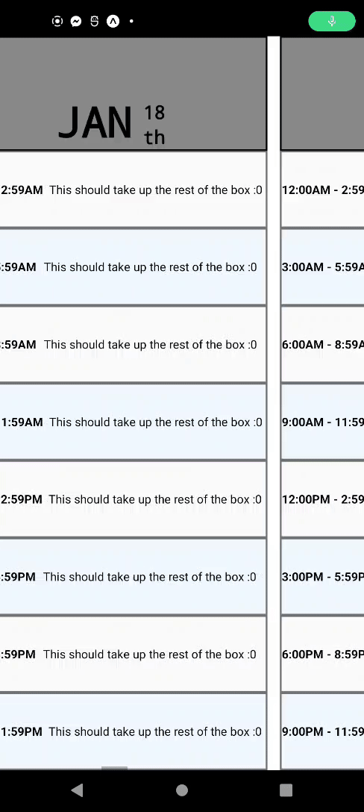
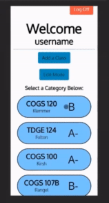

# Steven Shoemaker Portfolio

## Maya Archeology Web Project

[Link](https://github.com/ucsdsteveshoe/Maya_Archeology_Web_CODELESS)  
 

Demonstration of my technical full-stack coding ability, throughout a full project lifecycle. A research project done in collaboration with UCSD's [Engineers for Exploration](https://e4e.ucsd.edu/maya-archaeology), taking scanned models of South American caves, and making them visible and navigable in a 3D Web VR environment. I was the sole contributor on the web project, though I received resources and guidance from mentors in E4E. A Typescript project that heavily uses the [BabylonJS](https://www.babylonjs.com/) Engine, run with [WebPack-Dev-Server](https://webpack.js.org/configuration/dev-server/) and Docker.

  

   

## GERD Buddy

[Link](https://github.com/ucsdsteveshoe/GERDBuddy)  
 

Demonstration of my front-end planning and design abilities. A solo project I started to track symptoms of GERD, while incomplete the idea is that it would be able to track patterns between custom set of data. A Typescript [React Native](https://reactnative.dev/) project run with [WebPack-Dev-Server](https://webpack.js.org/configuration/dev-server/).

 
   

## Grade Guru

[Link](https://github.com/ucsdsteveshoe/Grade_Guru)  
 

Demonstration of my collaborative design and full-stack coding abilities. A group project designed to manage a user's grades, served as the final for my COGS 121 class. A pure Javascript project with CSS managed by [Bootstrap](https://getbootstrap.com/) and hosted on Heroku.

  
